# 📘 Tài liệu hướng dẫn sử dụng Script cấu hình Mail Server

---

## 🧩 I. Giới thiệu

Script cung cấp các chức năng:

* Cài đặt gói tin cần thiết.
* Cấu hình **DNS Server**.
* Cấu hình **Mail Server** trên hệ điều hành **CentOS**.

### 🧭 Menu chính
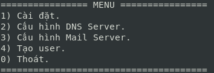

Chức năng cấu hình DNS Server được sử dụng lại từ:

> [https://github.com/minhluquang/autoscript-dns-server.git](https://github.com/minhluquang/autoscript-dns-server.git)

---

## ⚙️ II. Hướng dẫn cài đặt

### 1. Tạo file chạy script

```bash
touch main.sh
```

### 2. Cấp quyền thực thi cho file

```bash
chmod +x main.sh
```

### 3. Truy cập vào [Repository](https://github.com/HoL0ngg/script-mailserver.git)

Truy cập repository chứa script cấu hình mail server.

### 4. Sao chép nội dung script

Nhấn vào **main.sh** trên GitHub, copy toàn bộ nội dung và **paste** vào file `main.sh` trên máy **CentOS**.

### 5. Chạy script dưới quyền root

```bash
su
./main.sh
```

> 💡 *Chú ý:* Nếu chưa có quyền root, hãy dùng lệnh `su` và nhập mật khẩu trước khi chạy script.

---

## 🧠 III. Hướng dẫn sử dụng

### 🔹 Bước 1: Cài đặt các gói tin

1.1. Cấu hình **network adapter** là **NAT** và cấu hình **IP sử dụng DHCP** để có thể truy cập Internet.

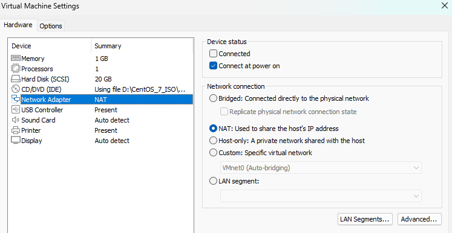

1.2. Chọn **chức năng 1. Cài đặt** để vào menu cài đặt.

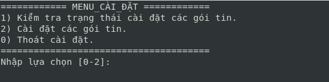

1.3. Chọn **chức năng 2. Cài đặt các gói tin** để bắt đầu cài đặt các gói cần thiết.

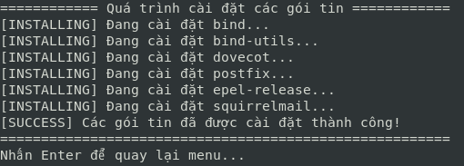

1.4. Sau khi cài đặt thành công, hãy cấu hình **network adapter sang Host-Only**.

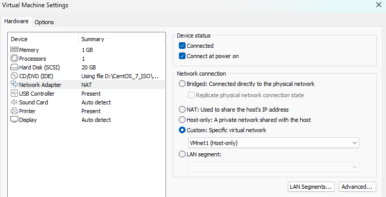

---

### 🔹 Bước 2: Cấu hình DNS Server

2.1. Chọn **chức năng 2. Cấu hình DNS Server** để vào menu cấu hình DNS.

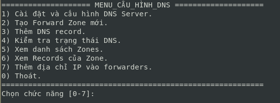

2.2. Chọn **chức năng 1. Cài đặt và cấu hình DNS Server.**
Nhập các thông tin mạng để cấu hình IP tĩnh:

```
Địa chỉ IP: 192.168.1.55
Subnet mask: 255.255.255.0
Gateway: 192.168.1.55
```
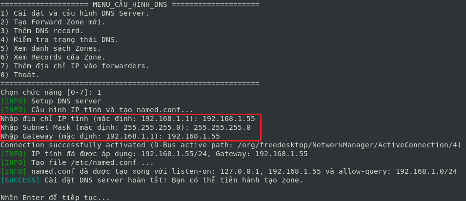

2.3. Chọn **chức năng 2. Tạo Forward Zone mới**
Nhập thông tin zone:

```
Tên miền: ongbau.vn
Địa chỉ IP: 192.168.1.55
```
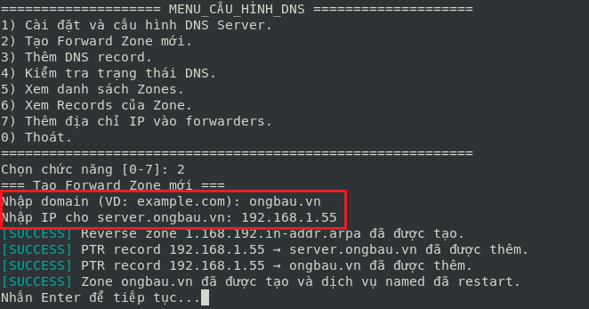

2.4. Chọn **chức năng 3. Thêm DNS Record** và nhập số thứ tự zone muốn thêm.

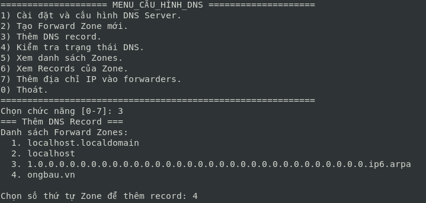

* Chọn **1** để thêm record A:

```
Hostname: mail
Địa chỉ IP: 192.168.1.55
```
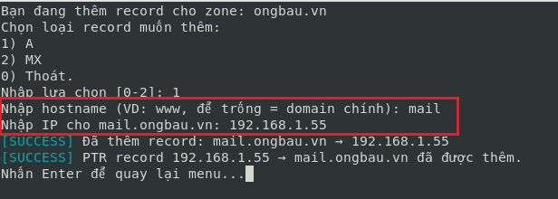

* Chọn **2** để thêm record MX:

```
Hostname: mail.ongbau.vn
Mức độ ưu tiên: 10
```
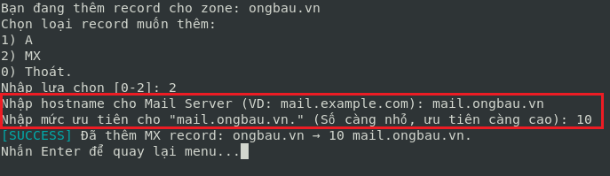

2.5. Nếu muốn gửi/nhận mail giữa **hai tên miền khác nhau**, cần cấu hình **forwarders** cho cả hai DNS Server:

Ví dụ:

```
DNS Server: ongbau.vn (192.168.1.55)
DNS Server: it.net (192.168.1.95)
```

Trên DNS Server **ongbau.vn** và **it.net**, chọn **chức năng 7. Thêm địa chỉ IP vào forwarder** rồi nhập IP tương ứng.

**DNS Server: ongbau.vn**

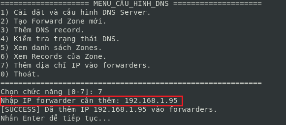

**DNS Server: it.net**

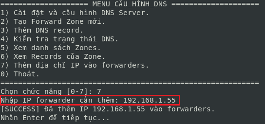

---

### 🔹 Bước 3: Cấu hình Mail Server

Chọn **chức năng 3. Cấu hình Mail Server**
Nhập thông tin:

```
Hostname: mail.ongbau.vn
Tên miền: ongbau.vn
```

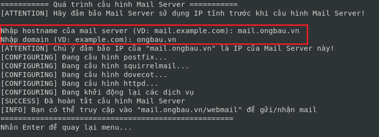

---

### 🔹 Bước 4: Tạo tài khoản người dùng

Chọn **chức năng 4. Tạo user**, sau đó nhập:

```
Username: <tên người dùng>
Password: <mật khẩu>
```

---

### 🔹 Bước 5: Truy cập Webmail

5.1. Mở trình duyệt **Firefox** (hoặc trình duyệt bất kỳ).
5.2. Truy cập webmail theo cú pháp `hostname/webmail`

```
*(ví dụ: mail.ongbau.vn/webmail)*
```
5.3. Nhập **username** và **password** đã tạo ở Bước 4 để đăng nhập và bắt đầu gửi/nhận mail.

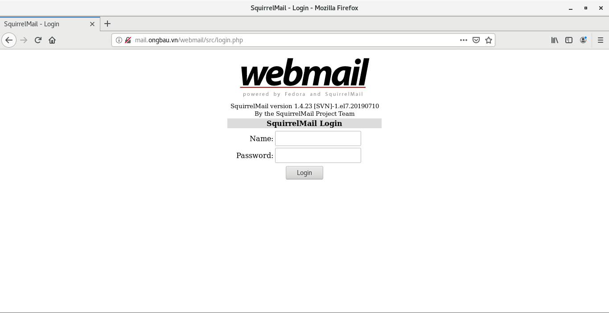

---

## 🎯 Kết luận

Bạn đã hoàn tất việc cài đặt và cấu hình **Mail Server** trên CentOS.
Chúc bạn sử dụng thành công và hệ thống hoạt động ổn định.

---

✅ **CHÚC BẠN THÀNH CÔNG!**
